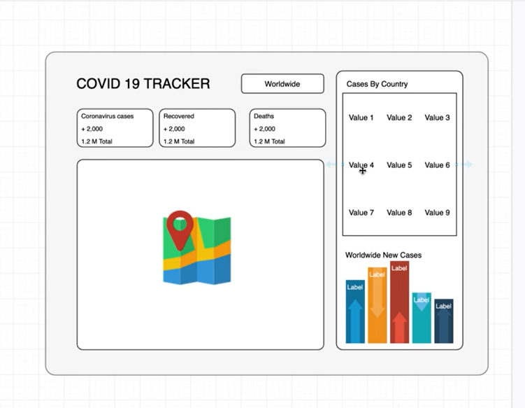

# COVID-19 Tracker
- create a wireframe to get a high-level overview of the end-result.
> The wireframe

    

- set up firebase project to deploy at the end after the development.
- clean up the project in public & src directories.
- the structure of the project involves
* Header (Title + input dropdown field)
* Info Box * 3
* Table
* Graph (Chart)
* Map

- The application is split into left & right sections with (header, dropdown, map) in former & rest (table & graph) in the latter.

- The header contains the logo/ name and the dropdown menu of all countries.
* The dropdown is a loop through of all countries and shw a dropdown of list.
- `https://disease.sh` is an open source service allows one to essentially access the pandemic, disease statistics across the world.
- The dropdown menu loop though the link `https://disease.sh/v3/covid-19/countries` to get the pandemic affected countries list to display.
- The three info boxes contains cases, recovered, deaths of today & all of a given country.
- The table component is set with a useState(), and is sorted by no.of.cases with util.js function.
- The LineGraph component contains a Line component from *react-chartjs-2* and the chart data is obtained from `https://disease.sh/v3/covid-19/historical/all?lastdays=120` link with async fetch function in useEffect().

- The deployed application is [here](https://covid-19-tracker-4b76c.web.app/)

### Ideas to consider in updating the application.
- Add a pie chart to the Covid Tracker at the bottom of the site
- Make the card clickable so the map reflects the data selected

- Change the line graph that will show call cases, recovered, and deaths
- Add a table on the side panel show the numbers of the countries

